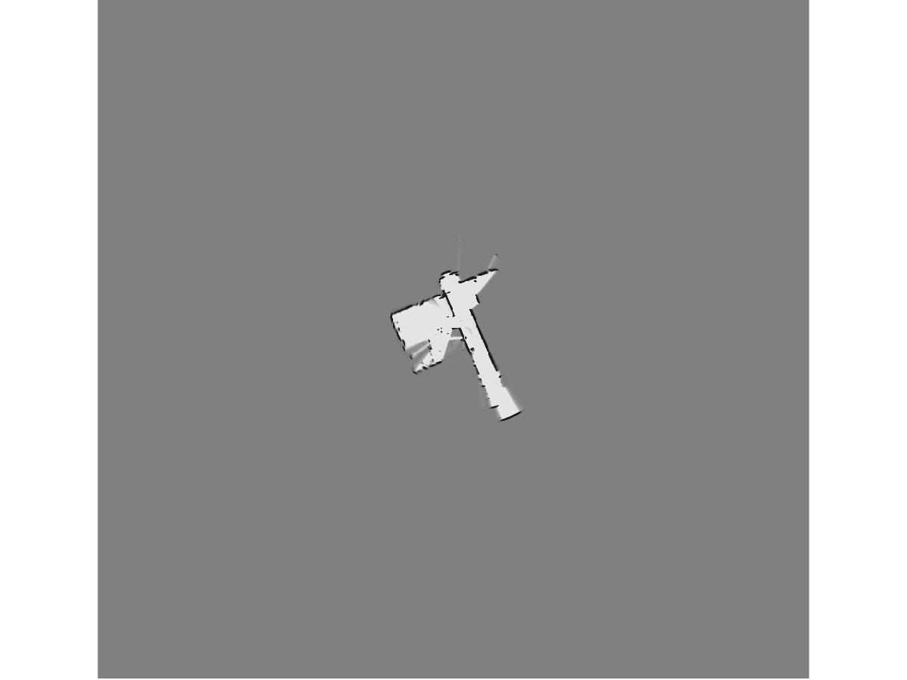
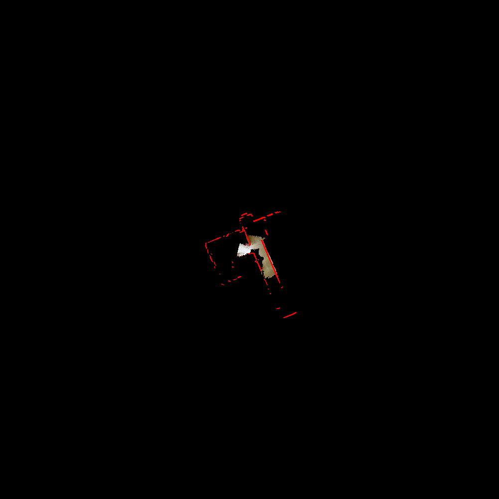

# SLAM using Particle Filter and Occupancy Grid Mapping with 3D Map Generation

## Problem Statement
Given data from a LIDAR make a 2D map of the environment using particle filter. Also use the RGBD data to obtain a birds eye view of the texture and 3D map.

## Usage Guide:
1. Run `Wrapper.m` for running SLAM.
2. Change the flags in `Wrapper.m` as needed.
3. By default, the code does not read images or record a video, the code also uses Random re-sampling of particles and does not use RPY information from IMU.
Also note that:
You'll need to following file naming structure to run the code:
Place the Depth image mat file called "DEPTH.mat" in "Depth" folder.
Place the RGB images mat file (can be named anything) in "RGB" folder.
Name the Joint mat file as "test_joint.mat" and place it in the "JointLidar" folder.
Name the Lidar mat file as "test_lidar.mat" and place it in the "JointLidar" folder.

Sample Outputs are places in the Outputs Folder with subfolders TestSet, TrainSet0, TrainSet1, TrainSet2 and TrainSet3.
Due to the robot's movement and kinect's bad calibration values the 3D-Point Cloud shouldn't be plotted for all samples (its also huge in size). So replace the second argument in the script
`Wrapper.m` line 78 to these values for the corresponding datasets.

TrainSet0: [1:2:170,210]
TrainSet3: [1:5:300,350:50:900]
TestSet  : [1:25:500,550:100:800,1050:10:1841]

## Report:
You can find the report [here](Report/nitinsan_project4.pdf).

## Sample Outputs:

<!---  -->

## References:
1. Dellaert, Frank, et al. "Monte carlo localization for mobile robots." Robotics and Automation, 1999. Proceedings. 1999 IEEE International Conference on. Vol. 2. IEEE, 1999.
2. Thrun, Sebastian, Wolfram Burgard, and Dieter Fox. Probabilistic robotics. MIT press, 2005.
3. ESE650 Class Notes and Slides.

